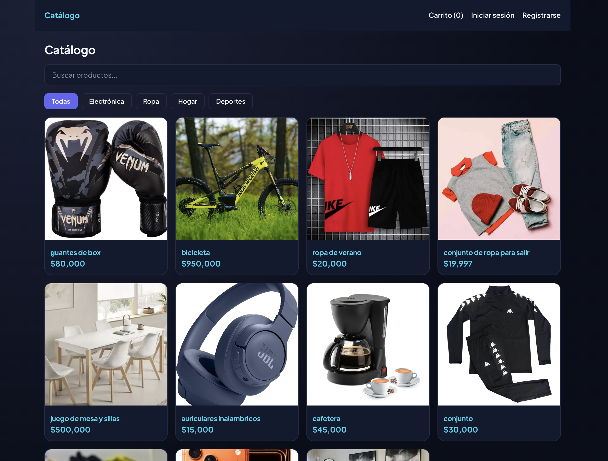
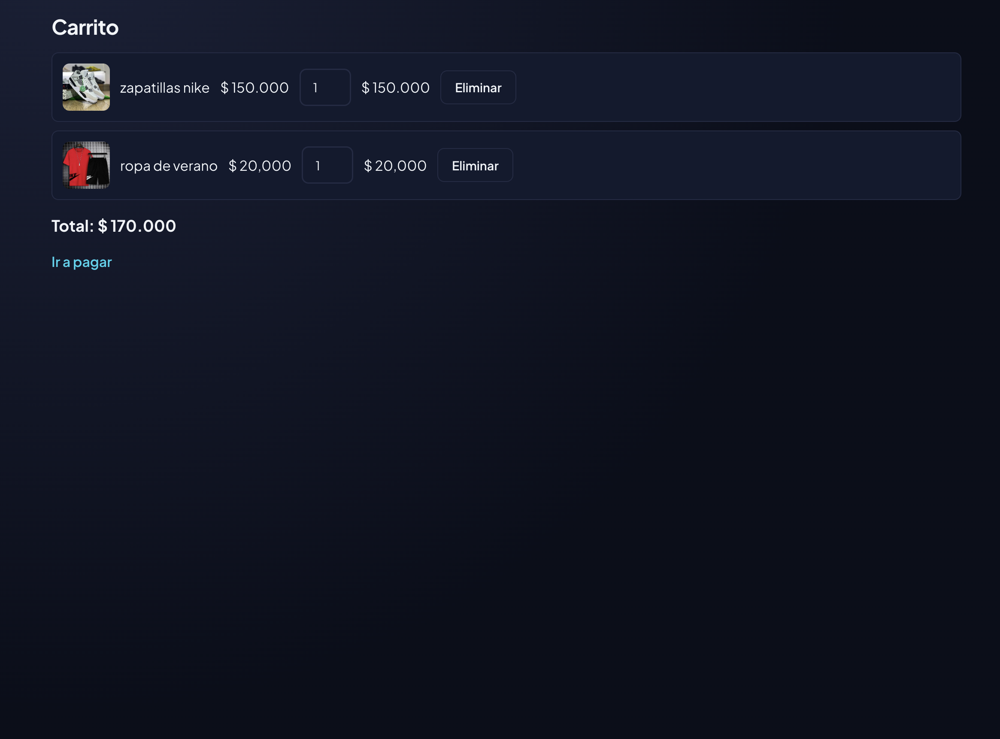
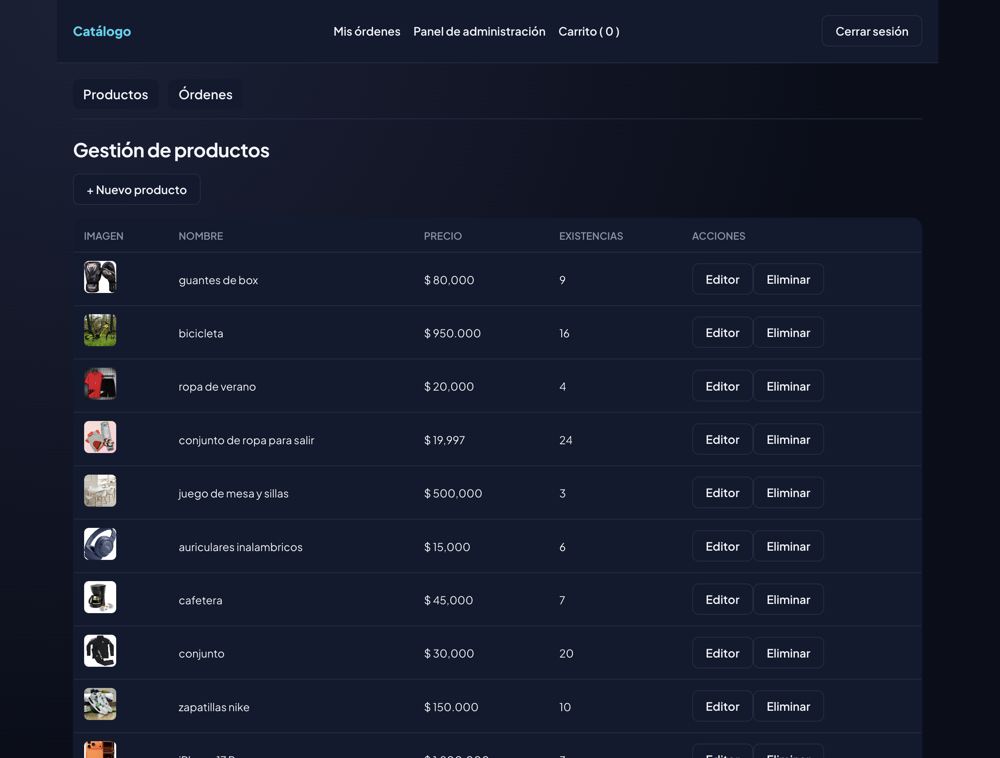

# 🛒 commerce-platform

Plataforma de comercio electrónico desarrollada con **React, TypeScript y Firebase**, con dos roles de usuario: cliente y administrador.

Incluye autenticación, catálogo con búsqueda y filtros, carrito de compras, checkout, gestión de órdenes, panel administrativo, carga segura de imágenes mediante AWS S3 y testing automatizado.

Proyecto Integrador 5 — Henry, especialización Frontend.

🔗 **Demo en vivo:**  
https://ai-ecommerce-sigma.vercel.app/

---

## 📸 Capturas

> Próximamente se agregarán capturas de las principales funcionalidades de la aplicación.


### Catálogo


### Carrito y checkout


### Panel de administración



---

## ✨ Funcionalidades principales

### 👤 Cliente

- Registro e inicio de sesión.
- Autenticación con email/contraseña y Google.
- Navegación del catálogo de productos.
- Búsqueda y filtrado de productos.
- Vista de detalle de producto.
- Carrito de compras.
- Checkout.
- Creación y consulta de órdenes.
- Rutas protegidas para usuarios autenticados.

### 🛠️ Administrador

- Acceso mediante rol de administrador.
- Panel administrativo protegido.
- Gestión del catálogo de productos.
- Carga de imágenes mediante AWS S3.
- Gestión de órdenes.
- Actualización de información en tiempo real.
- Protección de operaciones mediante reglas de Firestore.

---

## 🧰 Stack tecnológico

### Frontend

- React 18
- TypeScript
- Vite
- React Router
- Context API
- useReducer

### Backend y servicios

- Firebase Authentication
- Firebase Firestore
- Vercel Serverless Functions
- AWS S3

### Testing

- Vitest
- React Testing Library

### Deploy

- Vercel

---

## 🏗️ Arquitectura

El proyecto está organizado **por características (Screaming Architecture)**.

La estructura permite identificar los principales dominios de la aplicación directamente desde `src/features/`: autenticación, productos, carrito, órdenes y administración.

```text
src/
├─ features/
│  ├─ auth/
│  │  ├─ components/
│  │  ├─ contexts/
│  │  ├─ hooks/
│  │  ├─ services/
│  │  ├─ types/
│  │  └─ utils/
│  │
│  ├─ products/
│  │  ├─ components/
│  │  ├─ hooks/
│  │  ├─ services/
│  │  └─ types/
│  │
│  ├─ cart/
│  │  ├─ contexts/
│  │  ├─ reducers/
│  │  ├─ hooks/
│  │  └─ types/
│  │
│  ├─ orders/
│  │  ├─ components/
│  │  ├─ services/
│  │  └─ types/
│  │
│  └─ admin/
│     ├─ components/
│     ├─ services/
│     ├─ pages/
│     └─ types/
│
├─ pages/
├─ components/
├─ routes/
├─ services/
├─ hooks/
└─ test/

api/
└─ get-upload-url.ts
```

---

## 🧠 Decisiones arquitectónicas

### Organización por características

El proyecto utiliza una estructura organizada por funcionalidades en lugar de separar únicamente por capas técnicas.

Esto permite mantener agrupado el código relacionado con cada dominio de negocio y facilita identificar rápidamente las principales áreas de la aplicación.

### Auth y Cart separados

La autenticación y el carrito utilizan contextos independientes.

Son dominios de estado diferentes, por lo que separarlos reduce el acoplamiento y facilita su mantenimiento y testing.

### useReducer para el carrito

El carrito posee múltiples acciones que modifican el mismo estado.

Centralizar estas operaciones mediante `useReducer` permite mantener la lógica de actualización en una función predecible y fácilmente testeable.

### Roles almacenados en Firestore

Firebase Authentication administra la identidad del usuario, mientras que el rol se almacena en:

```text
users/{uid}
```

Las reglas de Firestore impiden que un usuario pueda modificar su propio rol.

### Actualizaciones según el contexto

Para el catálogo público se utilizan consultas puntuales mediante `getDocs`.

En el panel administrativo se utiliza `onSnapshot`, permitiendo reflejar cambios en tiempo real.

---

## ☁️ Carga de imágenes con AWS S3

Las imágenes de los productos se cargan utilizando **URLs prefirmadas de AWS S3**.

Esto permite realizar las cargas sin exponer credenciales de AWS en el navegador.

### Flujo

1. El administrador selecciona una imagen.
2. El frontend solicita una URL de subida a `/api/get-upload-url`.
3. La función serverless valida los datos del archivo.
4. Se genera una URL prefirmada mediante AWS SDK.
5. La URL temporal se devuelve al frontend.
6. El navegador realiza directamente un `PUT` hacia S3.
7. La URL pública de la imagen se almacena en Firestore.

La URL prefirmada tiene una duración limitada y las credenciales de AWS permanecen únicamente del lado del servidor.

---

## 🔐 Seguridad

El proyecto implementa diferentes medidas para proteger información y operaciones sensibles:

- `.env` está incluido en `.gitignore`.
- `.env.example` documenta las variables necesarias sin valores reales.
- Las credenciales de AWS solo existen en la función serverless.
- Las reglas de Firestore validan permisos administrativos.
- Un usuario no puede modificar su propio rol.
- Las órdenes nuevas se validan para comenzar con estado `pending`.
- Las operaciones de carga en S3 requieren una URL prefirmada válida.
- Las rutas administrativas están protegidas en el frontend.

---

## 🧪 Testing

La aplicación utiliza **Vitest y React Testing Library**.

Para ejecutar los tests:

```bash
npm run test
```

La suite incluye pruebas sobre:

- Reducer del carrito.
- Acciones y casos límite del carrito.
- Hook `useDebounce` utilizando fake timers.
- Hook `useCart`.
- Providers compartidos.
- Rutas administrativas.
- Diferentes estados de autenticación.
- Integración entre componentes y `CartProvider`.

---

## 🚀 Instalación y desarrollo local

### Requisitos

Para ejecutar el proyecto se necesita:

- Node.js 18+
- npm
- Firebase
- Firestore
- AWS S3
- Vercel CLI

### 1. Clonar el repositorio

```bash
git clone https://github.com/GonzaloB1/ProyectoM5_GonzaloBastias.git
```

### 2. Entrar al proyecto

```bash
cd ProyectoM5_GonzaloBastias
```

### 3. Instalar dependencias

```bash
npm install
```

### 4. Crear las variables de entorno

```bash
cp .env.example .env
```

### 5. Ejecutar el proyecto

```bash
vercel dev
```

Se utiliza `vercel dev` porque el proyecto incluye una función serverless dentro de `/api`.

Vite por sí solo no sirve esas funciones.

---

## ⚙️ Scripts disponibles

| Comando | Descripción |
| --- | --- |
| `npm run dev` | Ejecuta únicamente el frontend con Vite |
| `vercel dev` | Ejecuta frontend + función serverless |
| `npm run build` | Verifica tipos y genera el build de producción |
| `npm run test` | Ejecuta la suite de tests |
| `npm run preview` | Ejecuta localmente el build de producción |

---

## 🔑 Variables de entorno

El archivo `.env` no debe subirse al repositorio.

El proyecto utiliza:

```env
VITE_FIREBASE_API_KEY=
VITE_FIREBASE_AUTH_DOMAIN=
VITE_FIREBASE_PROJECT_ID=
VITE_FIREBASE_STORAGE_BUCKET=
VITE_FIREBASE_MESSAGING_SENDER_ID=
VITE_FIREBASE_APP_ID=

AWS_REGION=
AWS_ACCESS_KEY_ID=
AWS_SECRET_ACCESS_KEY=
AWS_S3_BUCKET_NAME=
```

Las variables `VITE_*` son utilizadas por el frontend.

Las credenciales de AWS permanecen únicamente del lado del servidor dentro de las funciones serverless.

---

## 🪣 Configuración de AWS S3

Para utilizar la carga de imágenes es necesario configurar un bucket de AWS S3.

El flujo utilizado por la aplicación requiere:

1. Crear un bucket de S3.
2. Configurar CORS para permitir las operaciones necesarias desde desarrollo y producción.
3. Configurar acceso público de lectura para las imágenes que deben mostrarse en la tienda.
4. Configurar los permisos necesarios para generar las URLs prefirmadas.
5. Agregar las credenciales correspondientes a las variables de entorno del servidor.

Las credenciales nunca deben incluirse directamente en el código fuente.

---

## 🤖 Uso de inteligencia artificial durante el desarrollo

Durante el desarrollo se utilizó **Claude (Anthropic)** como asistente de aprendizaje y apoyo técnico.

La IA se utilizó principalmente para comprender conceptos, analizar alternativas y acompañar la resolución de problemas. Las soluciones fueron revisadas, implementadas y probadas manualmente antes de continuar.

### Arquitectura del proyecto

Se analizaron diferentes formas de organizar el código, especialmente la diferencia entre una estructura por capas técnicas y una estructura por características.

Finalmente se adoptó una organización por características debido a los distintos dominios presentes en el proyecto.

### useReducer para el carrito

Se analizó cuándo utilizar `useReducer` en lugar de múltiples estados independientes.

La decisión permitió centralizar las operaciones del carrito dentro de un reducer tipado.

### Debugging de AWS S3

Durante la implementación de URLs prefirmadas apareció un error al realizar el `PUT` hacia S3.

El problema se investigó por etapas hasta identificar el comportamiento del checksum automático del AWS SDK v3.

La configuración fue ajustada utilizando:

```ts
requestChecksumCalculation: "WHEN_REQUIRED"
```

### Flujo de checkout

Se analizó el orden correcto de las operaciones del checkout.

La aplicación crea primero la orden con estado:

```text
pending
```

y posteriormente completa el flujo correspondiente, evitando perder el contenido del carrito ante un error.

El proyecto utiliza un pago simulado y no integra una pasarela de pagos real.

### React Router y Vercel

Durante el despliegue se detectó que acceder directamente a rutas como:

```text
/login
```

provocaba un error `404`.

Se agregó una configuración mediante `vercel.json` para que las rutas de la SPA sean gestionadas correctamente por React Router.

### Priorización del desarrollo

Durante el proyecto se priorizaron:

1. Funcionalidad.
2. Arquitectura.
3. Seguridad.
4. Testing.
5. Diseño visual.

Esto permitió completar primero las partes funcionales y técnicas antes de dedicar tiempo al refinamiento visual.

---

## 📚 Aprendizajes

Este proyecto me permitió profundizar conocimientos en:

- Arquitectura de aplicaciones React.
- Manejo de estado con Context API y useReducer.
- Autenticación y autorización.
- Firebase y Firestore.
- Integración con AWS S3.
- Serverless Functions.
- Seguridad de credenciales.
- Testing de componentes y hooks.
- Debugging de integraciones externas.
- Deploy de aplicaciones SPA.

---

## 👨‍💻 Autor

**Gonzalo Bastias**

Frontend Developer Jr. | React · TypeScript · Node.js

- GitHub: https://github.com/GonzaloB1
- LinkedIn: https://www.linkedin.com/in/gonzalo-bastias-161320430/